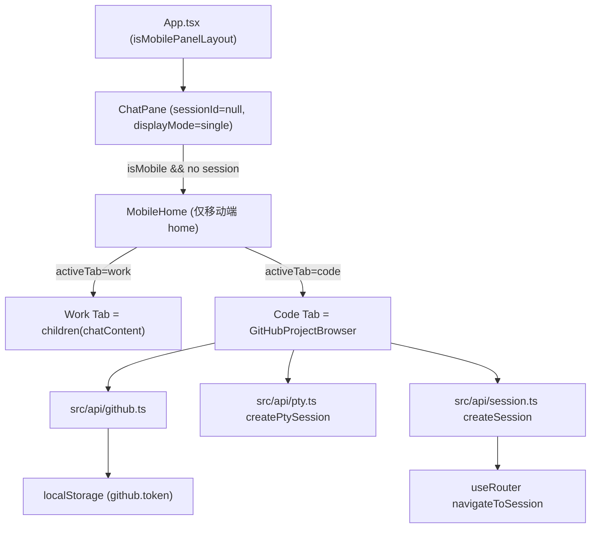

# Mobile Home Tabs (Work/Code)

Feature Name: mobile-home-tabs
Updated: 2026-08-25

## Description

将 opencodeui 移动端首页改造为类似 TRAE Android 的双 Tab 结构：进入应用（无活动会话、移动端视口）时展示顶部 Work/Code 两个页签。

- **Work Tab**: 原默认新对话主页（复用现有 home 渲染，即空 ChatArea + InputBox）。
- **Code Tab**: GitHub 项目浏览器。用户输入 GitHub Personal Access Token（PAT），浏览自己的仓库、选择分支、将仓库克隆到固定工作区目录 `~/OpenCodeUI-Projects/{owner}/{repo}`，然后进入基于该目录的 AI 编程会话。

仅移动端（视口 < 768px）生效，桌面端行为保持不变。

## Architecture



### 架构说明

1. **渲染注入点**: `MobileHome` 作为 ChatPane 在 `displayMode === 'single'`、`sessionId === null`、且移动端视口时的包裹外壳。Work Tab 直接渲染 `chatContent`（现有 home 状态），Code Tab 渲染 `GitHubProjectBrowser`。这避免改动 App 布局与 pager 结构，克隆后返回首页时依然走原 `navigatePaneHome` 逻辑。
2. **GitHub 鉴权**: Token 由用户在 Code Tab 内输入，持久化到 `localStorage`（key: `github.token`）。前端直接调用 GitHub REST API（`api.github.com`），token 仅存在于浏览器本地，不发送到 opencode 服务器。
3. **git 操作**: opencode 后端无 git clone/branch 端点（已核对 `openapi_doc.json`），因此通过 `createPtySession` 创建一次性 PTY 会话执行 shell 命令（`git clone` / `git switch` / `git -C <dir> ls-remote` 等），通过 PTY WebSocket 输出中的退出码哨兵判定完成。
4. **进入编程会话**: 克隆完成后调用 `createSession({ directory })`（`src/api/session.ts`），再通过 `useRouter().navigateToSession` 写入 `#/session/{serverId}::{sessionId}?dir={path}`，ChatPane 按路由加载该 session。

## Components and Interfaces

### MobileHome (`src/features/home/MobileHome.tsx`)

```tsx
interface MobileHomeProps {
  activeServerId: string
  children: ReactNode              // Work Tab 内容（chatContent）
  onStartCoding: (directory: string) => Promise<void>  // 克隆完成后进入会话
}
```

- 状态: `activeTab: 'work' | 'code'`，默认 `'work'`。
- 顶部渲染两个 tab 按钮（Work / Code），下方渲染对应内容。
- Code Tab 内容挂在内部 `<GitHubProjectBrowser>`。

### GitHubProjectBrowser (`src/features/home/GitHubProjectBrowser.tsx`)

状态机：`token-input` → `repo-list` → `branch-select` → `cloning` → `ready` / `error`。

| 阶段 | 说明 |
|------|------|
| token-input | 无 token 时展示 PAT 输入框与保存按钮；保存到 localStorage 并立即拉取仓库 |
| repo-list | 拉取 `/user/repos`，展示仓库名 + 描述，点击进入分支选择 |
| branch-select | 拉取 `/repos/{owner}/{repo}/branches`，默认选中 default_branch，提供确认按钮 |
| cloning | 执行 git 操作，展示进度与日志尾部 |
| ready | 克隆/复用成功，展示「进入 AI 编程」按钮 |
| error | 展示错误信息 + 重试/返回 |

### GitHub API 客户端 (`src/api/github.ts`)

```ts
const STORAGE_KEY_GITHUB_TOKEN = 'github.token'

export function getGitHubToken(): string | null
export function setGitHubToken(token: string): void
export function clearGitHubToken(): void

export interface GitHubRepo {
  id: number
  full_name: string          // owner/name
  owner: string
  name: string
  description: string | null
  default_branch: string
  private: boolean
}

export interface GitHubBranch {
  name: string
  commit: { sha: string }
}

export async function fetchUserRepos(token: string): Promise<GitHubRepo[]>
export async function fetchRepoBranches(token: string, owner: string, repo: string): Promise<GitHubBranch[]>
```

- 请求头 `Authorization: Bearer {token}`，`Accept: application/vnd.github+json`。
- 仓库列表使用 `GET /user/repos?sort=updated&per_page=100`；分支使用 `GET /repos/{owner}/{repo}/branches?per_page=100`。

### 目录与克隆工具 (`src/features/home/gitClone.ts`)

```ts
export const PROJECTS_ROOT_NAME = 'OpenCodeUI-Projects'
export function projectsRootDir(serverId: string): string   // 通过 getPath 计算 ~
export function repoWorktreeDir(projectsRoot: string, owner: string, repo: string): string
export function repoExists(projectsRoot: string, owner: string, repo: string): Promise<boolean>  // PTY test -d
export async function cloneRepo(
  opts: { serverId: string; worktree: string; repoUrl: string; branch: string; overwrite: boolean },
): Promise<void>
```

- 克隆命令：`git clone --branch {branch} --depth 1 {repoUrl} {worktree}`（本地不存在时）。
- 已存在 + 重选分支：`git -C {worktree} fetch origin --depth 1 {branch} && git -C {worktree} switch --force {branch}`。
- 通过 `createPtySession({ command, args, cwd })`（`src/api/pty.ts`）执行，随后立即连接 PTY WebSocket 收集全部输出；进程退出时服务器关闭连接，前端从输出中解析末尾的 `__OPENCODEUI_EXIT__:<code>` 哨兵行得到退出码。
- 已知限制：该版本服务器在 PTY 进程退出后立即销毁会话记录，状态轮询与 `/file` 读端点均不可用。
- 防丢输出：脚本以 `sleep 1` 开头，保证客户端完成 WS 握手后才开始真正的命令——毫秒级失败的命令（如 token 无权限时 git 秒退）会在会话销毁时连输出一起消失。
- 单脚本流程：探测/克隆/切换合并为一个 shell 脚本在单个 PTY 内执行，通过 `__OPENCODEUI_STATUS__:<stage>` 标记行上报阶段（ready/switching/cloning/conflict），前端实时解析用于进度展示与结果判定。分支内失败立即输出哨兵并 exit，避免 if 复合命令覆盖真实退出码。

### ChatPane 集成

在 `src/features/chat/ChatPane.tsx` 中：

- 引入 `useIsMobile()`。
- `const showMobileHome = isMobile && !routeSessionId && displayMode === 'single'`
- 渲染时若 `showMobileHome`，用 `<MobileHome>` 包裹 `chatContent`；否则原样渲染。
- `onStartCoding` 实现：`apiCreateSession({ directory })` → `navigateToSession(makeSessionKey(activeServerId, session.id), directory)`（复用 ChatPane 已有 `navigateToSession`/`paneServerId`）。

### 设置面板（可选）

新增 SettingsTab `github`，复用 `getGitHubToken/setGitHubToken` 展示与清除 token，作为 Code Tab 内联输入外的补充入口。仅当不增加维护负担时纳入。

## Data Models

### localStorage

| Key | 值 | 说明 |
|-----|-----|------|
| `github.token` | string | GitHub PAT，浏览器本地持久化 |

### 路由

克隆完成进入会话：`#/session/{serverId}::{sessionId}?dir={worktree}`（由 `useRouter().navigateToSession` 生成，hash 路由）。

## Correctness Properties

1. 桌面端（>= 768px）永不渲染 `MobileHome`，现有行为不变。
2. `MobileHome` 仅在移动端 + home（无 session）+ single pane 时渲染；存在 session 或 split 时不出现。
3. Token 不写入任何后端请求；opencode 服务器不感知 GitHub token。
4. 克隆目录固定为 `~/OpenCodeUI-Projects/{owner}/{repo}`；已存在时复用（不再重复 clone），仅按需切换分支。
5. 克隆失败不进入会话，展示可重试的错误信息。
6. 切换 tab / 退出 Code 页不影响已克隆目录，重新进入 Code 页仍复用。

## Error Handling

| 场景 | 处理 |
|------|------|
| Token 无效 / 401 / 403 | 展示鉴权失败提示，回到 token-input 阶段 |
| GitHub 网络错误 | 展示错误 + 重试按钮 |
| `git clone` 失败（网络/权限/路径冲突） | 展示 git 错误输出尾部 + 重试 |
| `createSession` 失败 | 展示错误 + 重试进入按钮 |
| 目标目录已存在且非 git 仓库 | 提示路径冲突，需用户确认覆盖或换名 |

## Test Strategy

- 单测（Vitest，与现有 `*.test.tsx` 风格一致）：
  - `gitClone.ts` 的目录拼接、clone 命令参数生成（不真实执行 git）。
  - `github.ts` 的 token 存取、请求 URL/header 构造（mock fetch）。
  - `MobileHome` tab 切换渲染。
- 手动验证：
  - 移动端视口（<768px）进入应用显示 Work/Code 双 Tab；桌面端不显示。
  - 配置 token → 仓库列表 → 分支选择 → 克隆 → 进入会话。
  - 已克隆仓库再次进入复用目录；重选分支切换成功。

## References

[^1]: `/workspace/openapi_doc.json` — 确认后端无 git clone/branch 端点，需 PTY 执行 shell 命令。
[^2]: `/workspace/src/features/chat/ChatPane.tsx#L841` — `chatContent` 渲染处，MobileHome 包裹注入点。
[^3]: `/workspace/src/api/pty.ts#L56` — `createPtySession(params, directory, serverId)`。
[^4]: `/workspace/src/api/session.ts#L113` — `createSession({ directory })`。
[^5]: `/workspace/src/hooks/useRouter.ts#L147` — `navigateToSession(sessionKey, directory)` hash 路由。
[^6]: `/workspace/src/hooks/useIsMobile.ts#L3` — 移动端断点 768。
[^7]: `/workspace/src/utils/perServerStorage.ts` — 按服务器隔离的 localStorage 读写模式参考。
